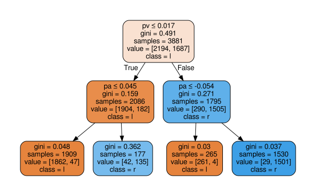

# MoET: Mixture of Expert Trees and its Application to Verifiable Reinforcement Learning
In this project we introduce Mixture of Expert Trees (MoET), which enhances Mixture of Experts (MoE) framework to support non-differentiable experts.

Next, we provide instructions on how to use the code and how to reproduce paper results.

## Install virtualenv
- Create a virtualenv. We created virtualenv with Python 2 (Python
  2.7.17) by running: `virtualenv ${OPT}/v_env`
- Activate the environment: `source ${OPT}/v_env/bin/activate`
- Install necessary requirements: `pip install -r requirements.txt`

## Test code
To test the code, do the following from the project root directory:

``` shell
cd python
python -m viper.evaluation.main \
    --subject_name=cartpole \
    --config_type=ViperPlus \
    --function=learn \
    --max_depth=2 \
    --max_iters=5 \
    --out_dir_name=test \
    --use_new_formula=True \
    --use_adam_optimizer=True \
    --choose_best_student_strategy=reward_and_mispredictions
```
This trains a Viper model with maximum depth 2, for 5 iterations of Dagger (we used 40 in our work). 
Output will be stored in `${PROJECT_ROOT}/data/experiments/cartpole/test/ViperPlus/`.
In that folder you can convert dot file representing student policy into a pdf file to visualize it, e.g., using: `dot -Tpdf dt_policy_d2.dot -o dt_policy_d2.pdf`.
Example of the learned policy:

Features of the observation space in cartpole are represented by *cp* (cart position), *cv* (cart velocity), *pa* (pole angle) and *pv* (pole angular velocity).

Next, you can evaluate the trained model:

``` shell
python -m viper.evaluation.main \
    --subject_name=cartpole \
    --config_type=ViperPlus \
    --function=evaluate \
    --max_depth=2 \
    --max_iters=5 \
    --out_dir_name=test \
    --use_new_formula=True \
    --use_adam_optimizer=True \
    --choose_best_student_strategy=reward_and_mispredictions
```
The experiment results will be stored in `${PROJECT_ROOT}/data/experiments/cartpole/test/ViperPlus/ViperPlus_evaluation.tex`
Similarly, you can train a MOET model:

``` shell
python -m viper.evaluation.main \
    --subject_name=cartpole \
    --config_type=MOE \
    --function=learn \
    --experts_no=2 \
    --experts_depths=0 \
    --max_iters=5 \
    --out_dir_name=test \
    --use_new_formula=True \
    --use_adam_optimizer=True \
    --choose_best_student_strategy=reward_and_mispredictions
```
Or, a MOETHard model:

``` shell
python -m viper.evaluation.main \
    --subject_name=cartpole \
    --config_type=MOEHard \
    --function=learn \
    --experts_no=2 \
    --experts_depths=0 \
    --max_iters=5 \
    --out_dir_name=test \
    --use_new_formula=True \
    --use_adam_optimizer=True \
    --choose_best_student_strategy=reward_and_mispredictions
```

## Create configurations for experiments
To create different configurations to train various models as we did in our evaluation, do the following:

``` shell
cd ${PROJECT_ROOT}/scripts/experiments
./create_configurations.sh --subject=cartpole
```
This will create configurations for Cartpole environment, in a similar way you can create it for the other environments
(currently supported subjects are: *cartpole*, *lunarlander*, *acrobot*, *mountaincar* and *pong*).
Inside of the `paramfiles/paramlist_cartpole` you will find one experiment per one line, which you can execute as you wish.

Additionally, when we train MOET models we examine couple of the best configurations and perform parameter sweeps on them.
Note that the previous files trains all MOET models with same initial learning rate and other parameters.
To create configurations with parameter sweeps you can:

``` shell
cd ${PROJECT_ROOT}/scripts/experiments
./create_parameter_sweeps.sh --subject=cartpole
```
The parameter file will be saved in `paramfiles/paramlist_cartpole_parameter_sweeps`.

You can do the same for other subjects. You can also encode yourself
which configurations you want to do experiments with by controlling
value of variable EXPERT_DEPTH_PAIRS.
